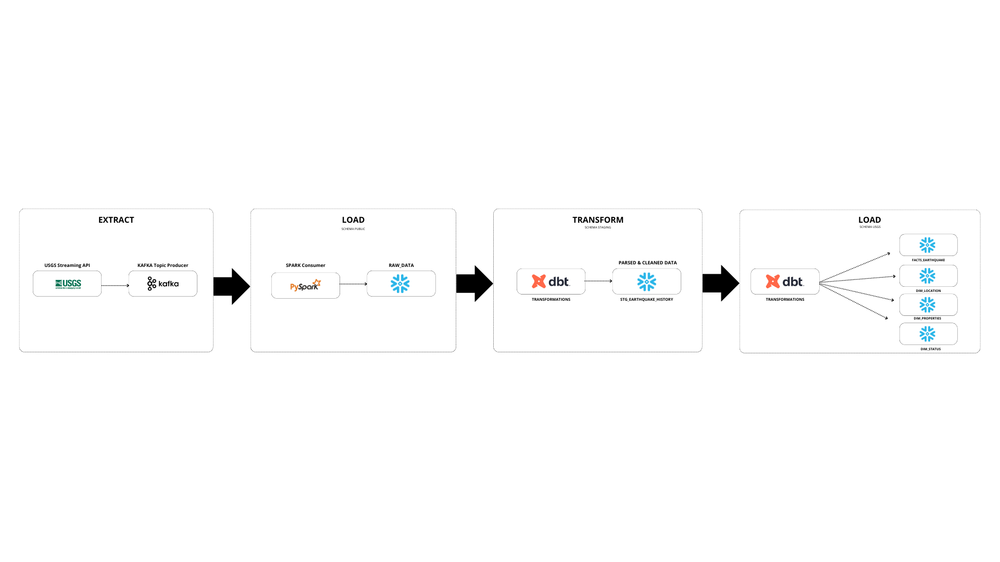

# Kafka-Snowflake Streaming Integration
## ELTL Process for Earthquake Data

This project demonstrates an **ELTL (Extract, Load, Transform, and Load)** process in the cloud, leveraging real-time data from the **USGS Earthquake API** to efficiently populate a Snowflake data warehouse. The pipeline manages the entire data flow, from real-time data extraction to structured storage, making the data suitable for analytics and further processing.

## Pipeline Overview



### Pipeline Steps:
1. **Extract**: Real-time earthquake data is extracted from the **USGS Earthquake API** and produced to a Kafka topic using a Kafka Producer. 
2. **Load**: The Kafka data stream is consumed using **Apache Spark (PySpark)**, and the raw data is loaded into a **Snowflake** staging table in the `PUBLIC` schema. 
3. **Transform**: The raw data in Snowflake is transformed using **dbt (Data Build Tool)** to apply cleaning, parsing, and business logic. The transformed data is stored in **Snowflake** in the `STG_EARTHQUAKE_DATA` schema, in a table called `STG_EARTHQUAKE_HISTORY`. 

   > **Note**: The staging table serves as a **debugging source** before feeding the cleaned data into the final schema. This ensures potential errors are addressed early, as feeding directly from the raw data could introduce multiple issues. For instance, the raw data contains **duplicate records** where entries may share the same `id` but have slight differences in the `registered_at` timestamp (down to milliseconds). To handle this, the transformation uses the **`ROW_NUMBER()`** function to eliminate duplicates, ensuring that only the most recent record for each `id` is retained.

4. **Load**: The final transformed data is distributed into the appropriate **fact** and **dimension** tables within the `EARTHQUAKE_DATA` schema. These tables follow a star schema design and include:
    - ****
    - ****
    - ****
    - ****   


For further details in this stage, you can access it directly here: 

## Technologies Used
- **Kafka**: For real-time data streaming.
- **Apache Spark (PySpark)**: For consuming and processing data from Kafka.
- **Snowflake**: For cloud data storage, with staging and final tables.
- **dbt (Data Build Tool)**: For data transformations and loading data into a star schema.
- **USGS Earthquake API**: The source for real-time earthquake data.

## Project Structure

```plaintext

earthquake-snowflake/
│
├── 1_data_ingestion/
│   ├── earthquake_producer.py
│   ├── requirements.txt
│   └── README.md
│
├── 2_data_processing/
│   ├── earthquake_consumer.py
│   ├── requirements.txt
│   └── README.md
│
├── 3_data_transformation/
│   ├── dbt_project.yml
│   ├── models/
│   │   ├── staging_data/
│   │   │   └── STG_EARTHQUAKE_HISTORY.sql
│   │   └── usgs_schema/
│   │       ├── DIM_LOCATION_USGS_EQ.sql
│   │       ├── DIM_PROPERTIES_USGS_EQ.sql
│   │       ├── DIM_STATUS_USGS_EQ.sql
│   │       └── FACTS_USGS_EQ.sql
│   ├── macros/
│   │   └── generate_schema_name.sql
│   └── README.md
│
├── 4_data_storage/
│   ├── final_data/
│   │   ├── 1_raw_earthquake_history_2024-10-19.csv
│   │   ├── 2_transformed_stg_earthquake_data_2024-10-19.csv
│   │   ├── 3_facts_usgs_eQ_2024_10_19.csv
│   │   ├── 4_dim_status_usgs_eq_2024-10-19.csv
│   │   ├── 5_dim_properties_usgs_eq_2024_10_19.csv
│   │   └── 6_dim_location_usgs_eq_2024_10_19.csv
│   └── README.md
│
├── assets/
│   ├── config.json
│   ├── pipeline_diagram.png
│   ├── dbt_lineage.png  
│   └── snowflake_diagram.png
│
└── README.md

```

## Usage Instructions

1. **Data Ingestion**: 
   Run the Kafka Producer script  to extract real-time earthquake data from the USGS API and produce it to a Kafka topic.

2. **Data Processing**: 
   Run the Kafka Consumer script  using Apache Spark to consume the Kafka topic and load the raw data into Snowflake.

3. **Data Transformation**: 
   Use dbt to transform the raw data stored in Snowflake. Run the dbt models (`dbt run`) to apply transformations and populate the staging table.

4. **Final Data Load**: 
   The transformed data will be loaded into the final fact and dimension tables using dbt.

